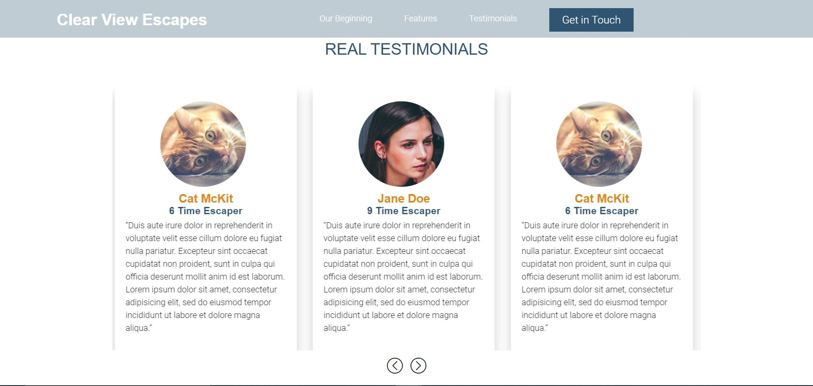

# Phila Tour website

Website designed for Phila Tour where you can travel in different places

# Getting Started

This website is made with the use of webpack using post-css and Node js and BEM methodology.

**Webpack**

- webpack is used to compile JavaScript modules. Once installed, you can interface with webpack either from its CLI or API. If    you're still new to webpack, please read through the core concepts and this comparison to learn why you might use it over the other tools that are out in the community.
 
 To run this project you need to install all dependencies which are required..
 for that run one command on cmd or bash:
 
 `npm init`
 
 
 `npm install`
 
 
 `npm run dev`
 
 And on web-browser run it by :
 
 `localhost:3000`
 
 Also to view the Mobile-reponsiveness put your `ip-address` of desktop and port-no `3000` 
 
 ## Screen-shots :
 
 
 
 

